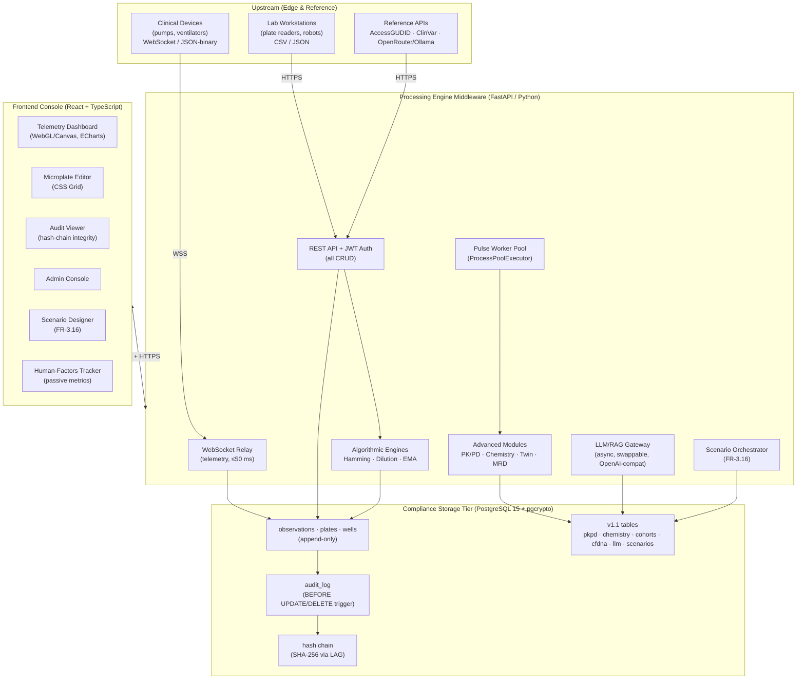

# BioSync-Gateway

**BioSync-Gateway eliminates the forced trade-off between life-saving real-time clinical telemetry and regulator-mandated, tamper-proof data integrity: it streams high-frequency surgical-device and laboratory signals at 100,000+ points/second while immutably archiving every record in an append-only, cryptographically hash-chained store that satisfies FDA 21 CFR Part 11 — so a bedside pump alarm and a seven-year audit trail come from the same pipeline without compromising either.**

---

## Table of Contents
- [The Problem](#the-problem)
- [What It Does](#what-it-does)
- [Architecture](#architecture)
- [Engineering Trade-offs — Why This Architecture?](#engineering-trade-offs--why-this-architecture)
- [How We Handle Edge Cases](#how-we-handle-edge-cases)
- [Technology Stack](#technology-stack)
- [Quick Start](#quick-start)
- [Project Structure](#project-structure)
- [Current Status & Roadmap](#current-status--roadmap)
- [Validation (IQ / OQ / PQ)](#validation-iq--oq--pq)
- [License](#license)

---

## The Problem

Clinical and laboratory instruments — arthroscopic pumps, ventilators, liquid-handling robots, NGS pipelines — produce two very different kinds of data that today live in disconnected systems:

1. **Fast data that must be seen now** — a pressure waveform that breaches 150 mmHg has ~100 ms to trigger an alarm before tissue damage; this demands 60 fps rendering and sub-50 ms relay.
2. **Slow data that must be trusted forever** — an audit trail proving *who* changed *what* and *when*, immutable against litigation, inspection, and error, retained for 7+ years under 21 CFR Part 11.

Most middleware forces a choice: optimize for throughput and you lose auditability; enforce strict immutability and your real-time path stalls. BioSync-Gateway is built around a single architectural bet — **decouple the real-time path from the compliance path** — so both requirements are met by construction rather than by policy.

---

## What It Does

BioSync-Gateway is a three-tier middleware bridging clinical-device telemetry and high-throughput laboratory automation to a centralized, append-only PostgreSQL store. It spans eight capability domains:

| # | Domain | Why it matters |
|---|--------|---------------|
| 1 | **Real-Time Telemetry Visualization** | WebGL/Canvas 2D rendering of pressure, flow, SpO₂, HR at 60 fps for immediate clinical decision-making. |
| 2 | **Laboratory Automation** | 96/384-well microplate management, multiplexing safety validation, and automated dilution worklists for liquid handlers. |
| 3 | **Physiological Simulation** | Kitware Pulse Physiology Engine for high-fidelity, reproducible patient baselines. |
| 4 | **FHIR Interoperability** | HL7 FHIR R4 `DeviceMetric` / `Observation` exchange for EHR/LIMS integration. |
| 5 | **Regulatory Data Integrity** | Database-level append-only triggers + `pgcrypto` SHA-256 hash chaining — compliance you cannot code around. |
| 6 | **Human Factors Instrumentation** | Passive UI metrics for uFMEA usability validation (alarm acknowledgment latency, interaction steps). |
| 7 | **Advanced Simulation & Analytics** | In-silico PK/PD lab loop, closed-loop chemistry generation, synthetic digital-twin cohorts, and an MRD/liquid-biopsy sandbox — all on synthetic, reproducible data. |
| 8 | **AI-Generated Clinical Text** | A swappable LLM/RAG gateway that synthesizes clinical narratives and pathology reports from structured data, isolated from the telemetry path. |

---

## Architecture



**Three trust boundaries, intentionally separate:**
1. **Frontend ↔ Middleware** — WebSocket (WSS) for telemetry, HTTPS/REST for CRUD, all behind JWT.
2. **Middleware ↔ Database** — PostgreSQL wire protocol over TLS 1.3, client-cert auth in addition to password (NFR-S5).
3. **Middleware ↔ Pulse / LLM** — in-process Python calls dispatched to worker pools; LLM inference is fully isolated from the telemetry event loop (C6).

---

## Engineering Trade-offs — Why This Architecture?

Every decision below was made to serve the *dual* mandate of speed + trust. Where we accepted a cost, it is stated explicitly.

**1. Decouple the real-time path from the compliance path.**
Streaming 100k points/sec while computing a SHA-256 hash chain on every write would saturate either the renderer or the auditor. By keeping ingestion async and pushing to a database whose *triggers* enforce immutability, the hot path stays fast and the cold path stays authoritative. *Cost:* no in-place updates anywhere — even a "correction" is a new append with a reason code, which is exactly what 21 CFR Part 11 wants.

**2. Enforce immutability in the database, not the application (C3).**
Application-layer audit guards can be bypassed by a buggy service, a cron job, or a direct SQL console. PostgreSQL `BEFORE UPDATE OR DELETE` triggers intercept **every** mutation source with no bypass path (FR-3.8.1/2). *Cost:* we trust the DB as the root of trust, so a nightly verification query (FR-3.8.4) recomputes the entire chain to catch any compromise below the trigger layer. This is stronger and cheaper than bolting on a blockchain or external ledger that a regulated hospital IT team cannot run.

**3. WebGL/Canvas with a swappable chart provider — never SVG/DOM (C4).**
At 100k+ points, SVG DOM manipulation saturates the browser and drops frames precisely when a clinician needs the alarm. ECharts is the open-source default; SciChart.js is a drop-in enterprise backend behind the same `chart-provider` abstraction (NFR-M2). *Cost:* we deliberately exclude 3D rendering to protect the DOM under high-throughput streams.

**4. FastAPI + ProcessPoolExecutor for the Pulse Engine (C1).**
Kitware Pulse's C++ core is single-threaded per patient. Delegating time-steps to a worker pool keeps the FastAPI event loop free, preserving the ≤50 ms WebSocket relay (NFR-P3) even while 10 simulations run (PQ-2). *Cost:* serialization overhead across the process boundary, mitigated by Protocol-Buffer state (FR-3.6.3).

**5. Pure-Python algorithms, NumPy only (NFR-M4).**
Hamming distance, the dilution solver, and the EMA filter are implemented in auditable, dependency-light Python so they can be line-reviewed for Computer System Validation. *Cost:* we forgo optimized numerics libraries that would complicate the validation evidence pack.

**6. Synthetic-only, seed-deterministic data (C2, C7).**
No PHI ever enters the system; cohorts and simulations are flagged `synthetic=true` and reproducible from stored seeds. This lets biopharma/CRO partners validate LIMS/EHR ingestion against realistic data without privacy exposure. *Cost:* the advanced modules still *synthesize* much of their physiology deterministically for reproducibility, but the live Pulse binary is now built, runs in-process, and is fully qualified (see "Pulse Engine Reliability Fixes" below).

**7. Swappable LLM provider + local static RAG (C8, C9).**
The AI gateway speaks the OpenAI-compatible SDK so OpenRouter and local Ollama/vLLM are interchangeable by config, and RAG context comes from a local directory of CAP/CLIA templates — no external vector DB, no data leaving the boundary. *Cost:* we trade the richer retrieval of a managed embedding service for air-gapped reproducibility and zero external dependencies.

**8. Graceful degradation by design (NFR-R2).**
If the Pulse Engine is unavailable, live device telemetry keeps flowing — the dashboard never goes dark because a simulation dependency failed. *Cost:* some advanced features are unavailable in that mode, which is acceptable because they are non-safety-critical.

---

## How We Handle Edge Cases

Robustness in BioSync-Gateway is enforced at the boundary that is hardest to bypass:

- **Tamper attempts are rejected at the storage layer.** Any `UPDATE`/`DELETE` on a finalized `audit_log` (or any v1.1 table) from the API, a cron job, or a manual `psql` session raises `RAISE EXCEPTION` and rolls back (FR-3.8.1/2, OQ-7/8).
- **Hash-chain breaks are caught, not assumed.** A nightly query recomputes every SHA-256 over the `LAG()`-chained row and reports the *exact* row where integrity fails (FR-3.8.4, OQ-9).
- **Barcode cross-contamination is blocked before pooling.** Plates with any pairwise Hamming distance `< 3` are rejected and the offending pair(s) returned to the operator (FR-3.3.2, OQ-2).
- **Impossible pipetting volumes are caught.** When a computed sample volume `< 0.5 µL` (robot floor), the system flags `DILUTION_BELOW_PIPETTE_LIMIT` and auto-injects a 1:10 → 1:100 pre-dilution serial routine (FR-3.4.2, OQ-4).
- **False alarms are prevented, not just displayed.** Alarms evaluate on the EMA-filtered signal (FR-3.5.4) so mechanical roller-jitter never pages a clinician; the raw stream is preserved as the compliance source of truth (FR-3.5.3).
- **Auth fails closed.** A missing JWT → 401; an expired JWT → 401 with `WWW-Authenticate: Bearer`; in production, an unset `JWT_SECRET` makes the app refuse to start (NFR-S2, OQ-13/14/15).
- **Bad FHIR is never silently stored.** Schema validation failures return an `OperationOutcome` at HTTP 422 (FR-3.7.4, OQ-11/12) instead of a corrupt `Observation`.
- **Telemetry survives disconnection.** WebSocket drops trigger automatic reconnection with message replay for missed points (NFR-R4); the DB pool reconnects with exponential backoff (NFR-R3).
- **The simulation engine never fakes success.** If `PyPulse` is not importable, initialization returns `False` with **no mock fallback** — compliance is never silently simulated (FR-3.6.1).
- **Scale is bounded, not hoped for.** The system targets ≥500 concurrent WebSocket sessions and 100k points/sec ingest (NFR-P1/P6), with LTTB downsampling keeping the live view responsive.

---

## Technology Stack

| Layer | Choice | Notes |
|-------|--------|-------|
| Frontend | React 18 + TypeScript + Vite | WebGL via ECharts (swappable to SciChart.js) |
| Realtime | WebSocket (WSS) + FastAPI | ≤50 ms relay; async event loop |
| API | FastAPI / Python 3.11+ | Pydantic v2, REST + JWT |
| Algorithms | Pure Python + NumPy | Hamming, dilution solver, EMA |
| Simulation | Kitware Pulse (`PyPulse`) | Delegated to `ProcessPoolExecutor` |
| Interop | `fhir.resources` (HL7 FHIR R4) | Validation + `OperationOutcome` |
| Storage | PostgreSQL 15 + `pgcrypto` | Append-only triggers, SHA-256 hash chain |
| Proxy | Nginx | TLS 1.3 termination, HSTS, client-cert verify |
| Orchestration | Docker Compose | Single `docker-compose.yml` (NFR-M1) |

---

## Quick Start

```bash
# 1. Configure secrets (never hard-code — NFR-S7/S8)
cp .env.example .env
# Edit .env and set JWT_SECRET and DB_PASSWORD

# 2. Start the full stack (DB + Nginx + Middleware + Frontend)
docker compose up --build

# 3. (Optional) Build with the real Kitware Pulse Engine
# MIDDLEWARE_DOCKERFILE=Dockerfile.pulse docker compose up --build

# 4. Apply database migrations (also run automatically on middleware start)
docker compose exec middleware alembic upgrade head
```

- Frontend: http://localhost:3000
- API docs: https://localhost/docs (Swagger UI, behind Nginx TLS 1.3)
- Health: https://localhost/health

> **TLS certs:** generate locally with `nginx/generate-certs.sh` for development. Production must inject certificates and DB client certs via Docker secrets.

---

## Project Structure

```
BioSync-Gateway/
├── frontend/                 # React/TS console (Telemetry, Microplate, Audit, Admin)
│   └── src/{pages,components,providers,hooks}
├── middleware/               # FastAPI backend
│   ├── api/                 # routes (telemetry, plates, fhir, simulations, pkpd,
│   │                        #         chemistry, digital_twin, mrd, auth, audit, …)
│   ├── engine/              # barcode, dilution, signal (EMA), lttb, hash_chain, pulse
│   ├── simulation/          # pkpd, chemistry, digital_twin, mrd_sandbox (scenarios: planned)
│   ├── external/            # accessgudid, clinvar clients (+ caching)
│   ├── alembic/             # migrations (incl. 0007 v1.1 advanced analytics)
│   └── models.py            # SQLAlchemy models for all SRS §6.1 tables
├── database/                # SQL init, seeds (Illumina UDI dictionary), hash-chain-check
├── nginx/                   # TLS 1.3 reverse proxy config + cert generation
├── tests/                   # IQ / OQ / PQ qualification suites
├── docs/                    # URS.md, FRS.md (specification)
├── SNDEV/                   # Contribution & audit logs
└── docker-compose.yml
```

---

## Current Status & Roadmap

BioSync-Gateway is **broadly code-complete and demo-complete against SRS v1.1**. The baseline (v1.0) compliance, security, and algorithmic engines are complete and tested; the advanced-analytics expansion (FR-3.11–FR-3.16, including the LLM/RAG gateway and the Scenario Designer UI) is implemented. Remaining work is frontend-weighted and tracked below and in `SNDEV/docs/impl-2026-07-29-srs-status-and-remaining-work.md`.

| Capability | State |
|------------|-------|
| Telemetry visualization, microplates, barcode safety, dilution solver, EMA, FHIR, audit/hash-chain, JWT auth, human-factors | ✅ Implemented & tested |
| Pulse Engine integration (FR-3.6) | ✅ Real `PyPulse` built, runs, and qualified (19/19 IQ/OQ/PQ) |
| Advanced modules — PK/PD, Clinical Chemistry, Digital Twin, MRD (FR-3.11–3.14) | ✅ Backend implemented, routed, unit-tested |
| **LLM/RAG Clinical Text Gateway (FR-3.15)** | ✅ Implemented — `api/routes/ai.py` + `ai/llm_gateway.py` + `ai/rag.py`; swappable OpenRouter/Ollama/vLLM (default `mock` for no-key startup) |
| **Scenario Orchestrator + Scenario Designer UI (FR-3.16)** | ✅ Implemented — `api/routes/scenarios.py` + `frontend/src/ScenarioDesigner`; NFR-U4 ≤5-interaction assembly verified |
| **Frontend (all 5 surfaces + Analytics Results)** | ✅ Implemented; 89/89 vitest green. Residual frontend gaps tracked in `SNDEV/docs/impl-2026-07-29-srs-status-and-remaining-work.md` (GAP-1…GAP-9) |

**Next priorities (frontend-weighted residual, 2026-07-29):** (1) **GAP-1** — render the alarm *trace* color change to red (FR-3.1.5; today only a banner + ack button); (2) **GAP-2** — capture alarm-trigger→acknowledgment selection latency (FR-3.9.1); (3) **GAP-4** — make the telemetry WebSocket URL an env-configurable `wss://` endpoint (NFR-S4); (4) **GAP-5** — clamp the JWT-expiry UI field to the NFR-S3 cap (1 h access / 24 h refresh); (5) **GAP-3 / 6 / 7 / 9** — add the `concentration gradient` well state, add `frontend/src/types/fhir.ts`, add a dedicated LLM-output/provenance viewer, and use exponential WS reconnect. Two formal deviations are recorded: **FR-3.1.3** (SciChart.js backend removed; ECharts-only) and **SRS §9** (flat `middleware/` layout). See `SNDEV/docs/impl-2026-07-29-srs-status-and-remaining-work.md` for the full per-FR matrix and evidence.

### Pulse Engine Reliability Fixes (v1.1 R1)

The real Kitware Pulse Engine now runs in-process and is fully qualified. Two classes of defects were resolved:

- **SIGSEGV root cause (R-FIX-E).** `pulse::Controller::Initialize` reloads the substance set from the **process CWD**, not from the `data_root_dir` supplied at `PulseEngine(...)` construction. When the container `WORKDIR` (`/app`) differed from the generated data root (`/pulse/bin`), the reload found nothing → `GetSubstance("Oxygen")` returned null → `AddActiveSubstance(*m_O2)` dereferenced a null pointer (SIGSEGV, exit 139). Because `PyPulse` exposes no data-root setter, the compat shim (`middleware/Pulse/__init__.py`) now temporarily `os.chdir(data_root_dir)` around `Engine.initialize_engine` and restores the prior CWD in a `finally` block. No C++ change and no public-API change.

- **Secondary production defects (exposed once the crash was gone).** With the engine actually executing, five further pre-existing bugs were fixed so IQ-4 / OQ-16 / PQ-2 / PQ-6 could pass:
  1. **Missing `import Pulse`** in `PulseWorker.initialize()` (raised `NameError`).
  2. **ndarray truth-value error** — `if not values` on a NumPy array in `_extract_metrics` raised `ValueError`; guarded with `if values is None`.
  3. **BINARY serialization** could not be decoded by the SWIG wrapper → `UnicodeDecodeError`; now serializes as **JSON**, and the shim translates the CDM `eSerializationFormat` enum to the `PyPulse.serialization_format` the binding expects.
  4. **SpO₂ units** — the engine reports a 0–1 fraction while qualification expects 80–100%; SpO₂ is now emitted as a percentage (×100).
  5. **`step_simulation` async/await mismatch** — it is a synchronous direct call but was declared `async def`; made a plain `def` and removed the invalid `await` in `api/routes/simulations.py`.
  6. **PQ-6 fixture ages** exceeded the engine's hard 65-year limit (geriatrics unsupported); fixture ages are now capped at 65.

**Validation:** full qualification against the rebuilt `biosync-pulse:local` image — **19/19 passed** (IQ-4 4/4, OQ-16 5/5, PQ-2 5/5, PQ-6 5/5). See `SNDEV/docs/impl-2026-07-28-pulse-segfault-fix.md` and `SNDEV/docs/impl-2026-07-28-pulse-segfault-diag-plan.md`.

---

## Validation (IQ / OQ / PQ)

The project is built for Computer System Validation under FDA General Principles of Software Validation. Qualification lives in `tests/`:

- **IQ** — environment, Python version, `pgcrypto`, PyPulse import, package integrity, trigger installation, Alembic upgrade.
- **OQ** — Hamming vectors & rejection, dilution boundaries & unit conversion, EMA convergence, audit-trigger rejection, tamper detection, FHIR validation, JWT auth, Pulse serialization, and per-module advanced-feature checks.
- **PQ** — 500-concurrent-WebSocket load, multi-patient Pulse, 1M-row hash-chain scan, 24h ingest, barcode-pairwise performance, ventilator stress, and LLM-isolation-under-load.

Most v1.1 tests are DB-gated (they skip cleanly without PostgreSQL and execute in CI against `postgres:15`).

---

## License

SPDX-License-Identifier: MIT

*Prepared as middleware for clinical-device telemetry and laboratory informatics under FDA 21 CFR Part 11.*
